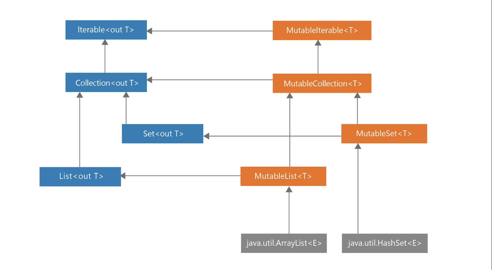

## 第1条：限制可变性

在Kotlin中，我们用模块来设计程序，每个模块都由不同种类的元素组成，如类、对象、函数、类型别名和顶级属性。其中一些元素可以持有状态，例如通过可读写的变量或通过一个可变的对象。
```kotlin
var a = 10
val list: MutableList<Int> = mutableListOf()
```

当一个元素持有状态时，它的行为不仅取决于你如何使用它，而且还取决于它被使用的历史。一个类持有状态的典型例子是“一个有一些资金余额的银行账户”。

```kotlin
 class BankAccount {
    var balance = 0.0
       private set

    fun deposit(depositAmount: Double) {
        balance += depositAmount
    }

    @Throws(InsufficientFunds::class)
    fun withdraw(withdrawAmount: Double) {
        if (balance < withdrawAmount) {
            throw InsufficientFunds()
        }
        balance -= withdrawAmount
    }
 }

 class InsufficientFunds : Exception()

 val account = BankAccount()
 println(account.balance) // 0.0
 account.deposit(100.0)
 println(account.balance) // 100.0
 account.withdraw(50.0)
 println(account.balance) // 50.0
```

在这个例子中，BankAccount有一个状态，表示该账户上有多少钱。持有状态是一把双刃剑。一方面，它非常有用，因为它可以表示随时间变化的元素，但另一方面，状态管理又很困难，因为：

1. 要理解和调试一个有许多可变点的程序更难。需要理解这些可变点之间的关系，而且当可变点较多时，更难跟踪它们是如何变化的。一个有许多可变点的类，它们相互依赖，往往真的很难理解和修改。尤其是在出现意外情况或错误的情况下，这个问题尤为明显。

2. 可变性使代码的分析更加困难。不可变元素的状态是明确的。可变的状态则更难理解。它更难被分析出它的值是什么，因为它可能会在任何时候发生变化，仅仅因为我们在某个时刻进行了检查，并不意味着它仍然是相同的。

3. 在多线程程序中它需要进行正确的同步。每一个改变都是一个潜在的冲突。

4. 可变的元素更难测试。我们需要测试每一种可能的状态，可变性越大，需要测试的状态就越多。更重要的是，我们需要测试的状态数量通常会随着同一对象或文件中的变异点数量呈指数增长，因为我们需要测试所有不同的可能状态组合。
5. 当状态发生变化时，往往需要通知其他一些类这个变化。例如，当我们在一个排序的列表中添加一个可变的元素时，一旦这个元素被改变，我们需要再次对这个列表进行排序。

对于在更大的团队中工作的开发者来说，随着可变点的增加导致的状态一致性的问题以及的项目复杂度不断增加是很常见的。让我们来看一个例子，以此说明管理共享状态有多难。请看下面的代码，它展示了多个线程试图修改同一属性，然而由于冲突，其中一些操作会丢失。

```kotlin
 var num = 0
 for (i in 1..1000) {
    thread {
        Thread.sleep(10)
        num += 1
    }
 }
 Thread.sleep(5000)
 print(num) // Very unlikely to be 1000
 // Every time a different number
```

当我们使用Kotlin协程时，由于涉及的线程操作较少，所以冲突较少，但还是会发生。

```kotlin
suspend fun main() {
    var num = 0
    coroutineScope {
        for (i in 1..1000) {
            launch {
                delay(10)
                num += 1
            }
        }
    }
    print(num) // Every time a different number
}
```

在实际项目中，我们一般不能随便丢失一些操作，因此我们需要实现正确的同步操作，比如下面展示的同步。虽然实现正确的同步是很难的，而且变异点越多，难度就越大。限制可变性确实有帮助。

```kotlin
 val lock = Any()
 var num = 0
 for (i in 1..1000) {
    thread {
        Thread.sleep(10)
        synchronized(lock) {
            num += 1
        }
    }
 }
 Thread.sleep(1000)
 print(num) // 1000
```

可变性的缺点非常多，以至于有些语言根本不允许修改状态。这些语言是纯粹的函数式语言。一个著名的例子是Haskell。不过这种语言很少用于主流开发，因为在可变性如此有限的情况下很难进行编程。修改状态是模拟现实世界状态的一种非常有用的方式。我建议使用可变性，但要少用，并明智地决定我们的可变点应该在哪里。好消息是，Kotlin对于限制变异性的支持很好。

#### 在Kotlin中限制可变性

Kotlin在设计之初就支持限制可变性。创建不可变的对象或属性很容易。Kotlin有许多语言特性，但最主要的是：

- 只读属性

- 可变和只读集合的分离

- 使用数据类中的`copy`

让我们逐一讨论这些特性。

#### 只读属性

在Kotlin中，我们可以把每个属性做成只读的val（类似于常量）或读写的var（类似于变量）。只读的属性值不允许设置。

```kotlin
val a = 10
a = 20 // ERROR
```

但是请注意，只读属性不一定是不可变的。一个只读的属性可以持有一个可变的对象。

```kotlin
val list = mutableListOf(1,2,3) 
list.add(4)

print(list) // [1, 2, 3, 4]
```

一个只读属性也可以使用一个可能依赖于另一个属性的自定义getter方法来定义。

```kotlin
var name: String = "Marcin"
var surname: String = "Moskała"
val fullName 
    get() = "$name $surname"

fun main() {
   println(fullName) // Marcin Moskała
   name = "Maja"
   println(fullName) // Maja Moskała
}
```

请注意，这是有可能的，因为当我们自定义一个getter时，每次我们取值时都会调用它。

```kotlin
 fun calculate(): Int {
    print("Calculating... ")
    return 42
 }
 
 val fizz = calculate() // Calculating...
 val buzz
    get() = calculate()
 
 fun main() {
    print(fizz) // 42
    print(fizz) // 42
    print(buzz) // Calculating... 42
    print(buzz) // Calculating... 42
 }
```

这个特性，即Kotlin中的属性默认是封装的，它们可以有自定义的访问器（getters和setters），在Kotlin中是非常重要的，因为当我们改变或定义我们的API时，它给了我们灵活性。这一点将在第16项中详细描述。不过核心思想是val不提供可变点，因为var既是getter又是setter时，而它只是一个getter。这也是为什么我们可以用var重写val。

```kotlin
interface Element {
   val active: Boolean
}

class ActualElement: Element {
   override var active: Boolean = false
}
```

只读属性的值可以改变，但这样的属性不提供可变点，而可变点是我们需要同步或分析程序时的主要问题来源。这就是为什么我们通常更倾向于使用val而不是var。

尽管val并不意味着不可改变，它可以由getter或委托（by）来定义，但是这个特性给了我们更多的可以改变的空间。当我们不需要这个特性的时候，直接使用val来定义属性即可，对它们进行分析也比较容易，因为它们的值就写在定义语句中。它们在Kotlin中也得到了更好的支持，例如，它们可以被智能转换：

```kotlin
val name: String? = "Márton"
val surname: String = "Braun"

val fullName: String?
   get() = name?.let { "$it $surname" }

val fullName2: String? = name?.let { "$it $surname" }

fun main() {
   if (fullName != null) {
       println(fullName.length) // ERROR
   }

   if (fullName2 != null) {
       println(fullName2.length) // Márton Braun
   }
}
```

对于`fullName`来说，智能转换是不可能的，因为它是用getter定义的，所以它在检查时可能会给出一个不同的值，而在以后的使用过程中又会有所不同（例如，如果其他线程会修改它的值）。非局部属性只有在它们是不可变的并且没有自定义的getter时才能被智能投递。

#### 可变和只读集合的分离

同样地，正如Kotlin分离了读写和只读属性一样，Kotlin也分离了读写和只读集合。这要归功于集合的层次结构设计。请看一下Kotlin中集合层次结构的图。在左边，你可以看到Iterable、Collection、Set和List接口都是只读的。这意味着它们没有任何允许修改的方法。在右边，你可以看到MutableIterable、MutableCollection、MutableSet和MutableList接口，它们代表可变的集合。注意，每个可变接口都继承了相应的只读接口，并增加了允许修改的方法，这类似于属性的工作方式。 一个只读属性意味着只有一个getter，而一个读写属性意味着既有一个getter又有一个setter。



只读集合不一定是不可变的，很多时候它们是可变的。但它们不能被修改，因为它们只有只读的接口。例如，Iterable<T>.map和Iterable<T>.filter函数将ArrayList（这是一个可变的列表）返回为List（这是一个只读的接口）。在下面的代码中，你可以看到来自stdlib的Iterable<T>.map的一个简化实现。

```kotlin
inline fun <T, R> Iterable<T>.map(
   transformation: (T) -> R
): List<R> {
   val list = ArrayList<R>()
   for (elem in this) {
       list.add(transformation(elem))
   }
   return list
}
```

让这些集合接口只读，而不是真正的不可变的设计是非常重要的。它给了我们更多的自由。在底层，任何集合都可以被返回，只要它满足接口的要求。因此，我们可以使用特定平台的集合。

这种方法的安全性接近于拥有不可变集合的安全性。唯一的风险是当一个开发者试图 "破坏系统 "并执行向下转型。这在Kotlin项目中是不应该被允许的。我们应该能够相信，当我们将一个列表返回为只读时，它将只被用来读取。这是一种编程规范。关于它的更多信息，请看本书的第二部分。

向下转型集合不仅破坏了它们的规范，依赖具体实现而不是抽象，而且它也不安全，会产生令人惊讶的结果。看一下这段代码吧。

```kotlin
val list = listOf(1,2,3)

// DON’T DO THIS!
if (list is MutableList) {
   list.add(4)
}
```

这个操作的结果是基于平台的。在JVM上，listOf返回Arrays.ArrayList的一个实例，该实例实现了Java List接口。这个Java List接口有像add或set这样的方法，所以Kotlin选择它来做MutableList接口的实现。然而，Arrays.ArrayList并没有实现其中的一些操作。这就是为什么上述代码的结果是这样的。

```kotlin
Exception in thread “main” java.lang.UnsupportedOperationException
at java.util.AbstractList.add(AbstractList.java:148)
at java.util.AbstractList.add(AbstractList.java:108)
```

我们不能保证以后这一情况会如何表现。底层的集合实现可能会改变。它们可能会被Kotlin实现的真正不可变的集合所取代，从而完全不实现MutableList。没有什么是可以保证的。这就是为什么在Kotlin中不应该将只读集合向下转型为可变集合。如果你需要从只读变为可变，你应该使用List.toMutableList函数，它可以创建一个副本，然后你可以修改这个副本。

```kotlin
val list = listOf(1, 2, 3)

val mutableList = list.toMutableList()
mutableList.add(4)
```

这种方式不会破坏任何规范，而且对我们来说也更安全，当我们把一些返回值类型设为`List`时，它不会被外部修改。

#### 使用数据类的`copy`

有很多理由让我们更倾向使用不可变的对象——不能改变其内部状态的对象，如String或Int。除了已经提到的我们通常喜欢更少的可变性的原因之外，不可变的对象也有自己的优势。

1. 它们更容易分析，因为一旦被创建，它们的状态就会保持不变。
2. 不可变性使程序更容易进行并行操作，因为共享对象之间没有冲突。
3. 对不可变对象的引用可以被缓存，因为它们不会改变。
4. 我们不需要对不可变的对象进行防御性拷贝。当我们拷贝不可变的对象时，我们不需要做深拷贝。
5. 不可变的对象是构建其他对象的完美材料。既可变又不可变。我们仍然可以决定可变性在哪里发生，而且对不可变的对象进行操作更容易。
6. 我们可以将它们添加到Set中，或者在Map中作为key使用，与不应该这样使用的可变对象相对立。这是因为这两个集合在Kotlin/JVM中都使用了哈希表，当我们修改已经分类到哈希表的元素时，会导致它的分类可能不再正确，我们将无法找到它。这个问题将在第41项中详细描述。当一个集合被排序时，我们也会有类似的问题。

```kotlin
val names: SortedSet<FullName> = TreeSet()
val person = FullName("AAA", "AAA")
names.add(person)
names.add(FullName("Jordan", "Hansen"))
names.add(FullName("David", "Blanc"))

print(s) // [AAA AAA, David Blanc, Jordan Hansen]
print(person in names) // true

person.name = "ZZZ"
print(names) // [ZZZ AAA, David Blanc, Jordan Hansen]
print(person in names) // false”
```

在最后一行中，尽管这个对象在这个集合中，但返回了false。因为它position计算有问题，所以找不到。

正如我们所见，可变对象更危险，更难预测。另一方面，不可变对象的最大问题是数据有时需要改变。解决的办法是，让不可变的对象含有一些方法，在一些变化后产生一个新对象。例如，Int是不可变的，它有很多方法，如加或减，这些方法不会修改它，而是在这个操作后返回一个新的Int对象。Iterable是只读的，像map或filter这样的集合处理函数并不修改它，而是返回一个新的集合。同样的道理也可以适用于我们的不可变对象。例如，假设我们有一个不可变的类User，我们需要允许它的姓氏改变。我们可以用一个withSurname方法来实现，该方法产生一个特定属性改变的副本。

```kotlin
class User(
   val name: String,
   val surname: String
) {
   fun withSurname(surname: String) = User(name, surname)
}

var user = User("Maja", "Markiewicz")
user = user.withSurname("Moskała")
print(user) // User(name=Maja, surname=Moskała)
```

我们可以编写这样的函数，但如果我们需要为每个属性都编写一个，代码会显得很冗长。 这时，我们就需要数据修改器来帮助我们了，它提供了一个`copy`方法。这个方法创建了一个新的实例，默认所有的主构造器中的属性默认都与前一个实例相同。copy和其他由数据修改器生成的方法将在项目37中详细讨论。下面是一个简单的例子来展示它是如何工作的：

```kotlin
data class User(
   val name: String,
   val surname: String
)

var user = User("Maja", "Markiewicz")
user = user.copy(surname = "Moskała")
print(user) // User(name=Maja, surname=Moskała)
```

这是一个优雅而通用的解决方案，支持使数据模型类不可变。当然，这种方式的效率不如直接使用可变对象，但它具有不可变对象的所有描述的优点，应该被默认为首选。

#### 不同种类的可变点

如果我们需要表示一个可变的列表。我们有两种方法可以实现。要么使用一个可变的集合，要么使用可读写的属性。

```kotlin
val list1: MutableList<Int> = mutableListOf() 
var list2: List<Int> = listOf()
```

这两种属性都可以被修改，但方式不同。

```kotlin
list1.add(1) 
list2 = list2 + 1
```

这两种方式也都可以用加赋值运算符来代替，但每一种都被转化为不同的行为。

```kotlin
list1 += 1 // Translates to list1.plusAssign(1) 
list2 += 1 // Translates to list2 = list2.plus(1)
```

这两种方式都是正确的，它们都有其优点和缺点。它们都有一个可变点，但它位于不同的地方。在第一种方式中，发生在具体的List实现上。在多线程情况下，我们可能依赖于它有适当的同步机制，但这样的假设也是危险的，因为它并没有真正得到保证同步性。在第二种情况下，我们需要自己实现同步，但总体的安全性更好，因为可变点只是一个单一的属性。不过，在缺乏同步的情况下，我们仍然可能丢失一些元素。

```kotlin
var list = listOf<Int>()
for (i in 1..1000) {
   thread {
       list = list + i
   }
}
Thread.sleep(1000)
print(list.size) // Very unlikely to be 1000, 
// every time a different number, like for instance 911
```

使用可变属性而不是可变列表，可以让我们在定义自定义setter或使用委托（即使用自定义setter）时跟踪该属性的变化。例如，当我们使用一个可观察的委托时，我们可以记录一个列表的每一次变化。

```kotlin
var names by Delegates.observable(listOf<String>()) { _, old, new ->
   println("Names changed from $old to $new")
}

names += "Fabio" 
// Names changed from [] to [Fabio]
names += "Bill"   
// Names changed from [Fabio] to [Fabio, Bill]”
```

为了使可变集合能够做到这一点，我们需要一个特殊的可观察的集合实现。对于可变属性的只读集合来说，控制它们的变化也比较容易——只有一个setter而不是多个方法来改变这个对象，而且我们可以把它变成私有的。

```kotlin
var announcements = listOf<Announcement>()
   private set
```

简而言之，使用可变集合是一个更容易实现的选择，但使用可变属性会让我们对对象的变化方式有更多的控制能力。

请注意，最糟糕的解决方案是同时拥有一个可变属性和一个可变集合。

```kotlin
// Don’t do that
var list3 = mutableListOf<Int>()
```

我们需要同步它的两种改变方式（通过属性变化和内部状态变化）。另外，由于含糊不清，使用加法赋值来改变它是不可能的。


通常来说，我们不应该创造不必要的方法来改变状态。每一种改变状态的方式都是一种成本。它需要被理解和维护。我们倾向于限制可变性。

#### 不要泄露可变点

当我们暴露了一个构成状态的可变对象时，这是一个特别危险的情况。看一下这个例子吧。

```kotlin
data class User(val name: String)

class UserRepository {
   private val storedUsers: MutableMap<Int, String> = 
       mutableMapOf()

   fun loadAll(): MutableMap<Int, String> {
       return storedUsers
   }

   //...
}
```

调用者可以使用loadAll来修改UserRepository的私有状态。

```kotlin
val userRepository = UserRepository()

val storedUsers = userRepository.loadAll()
storedUsers[4] = "Kirill"
//...

print(userRepository.loadAll()) // {4=Kirill}
```

当这种修改是意外情况的时候，就特别危险。我们有两种方法可以处理这个问题。第一种是复制返回的可改变对象。我们称之为防御性复制。当我们处理一个标准的对象时，这可能是一种有用的技术，在这个例子中，由数据修改器产生的拷贝可能会起到很大的帮助：

```kotlin
class UserHolder {
    private val user: MutableUser()

    fun get(): MutableUser {
        return user.copy()
    }

    //...
}
```

但只要有可能，我们更倾向于限制可变性，对于集合，我们可以通过将这些对象向上转型到其只读的超类来实现：

```kotlin
data class User(val name: String)

class UserRepository {
   private val storedUsers: MutableMap<Int, String> = 
       mutableMapOf()

   fun loadAll(): Map<Int, String> {
       return storedUsers
   }

   //...
}
```

#### Summary

在这一章中，我们已经了解了为什么限制可变性和优先使用不可变的对象很重要。我们看到Kotlin给我们提供了很多支持限制可变性的工具。我们应该使用它们来限制可变点。简单的规则是。

- 优先选择val而不是var
- 优先选择不可变的属性，而不是可变的属性。
- 优先选择不可变的对象和类，而不是可变的。
- 如果你需要它们被改变，可以考虑让它们成为不可变的数据类，并使用`copy`方法来改变
-  当你持有状态时，优先选择只读而不是可变的集合
- 明智地设计你的可变点，不要产生不必要的可变点
-  不要暴露出可变的对象

这些规则也有一些例外。有时我们更倾向于选择一个可变的对象，因为它们更有效率。这样的优化应该只在我们代码的性能关键部分优先使用（第3部分：效率），当我们使用它们时，我们需要记住，当我们使用多线程时，需要更多的关注可变性。最基本的准则是，我们应该限制可变性。
