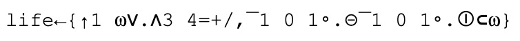

# Chapter 2: Readability

> *Any fool can write code that a computer can understand. Good programmers write code that humans can understand.*
> –Martin Fowler, *Refactoring: Improving the Design of Existing Code, p. 15*

There is a very common misconception that Kotlin is designed to be concise. It isn’t. There are languages that are much more concise. For instance, the most concise language I know is APL. This is John Conway’s “Game of Life” implemented in APL:



Your first thought is probably “Wow, that’s short”. Then you might realize that you don’t have some of those characters on your keyboard. There are more such languages, for example, here is the same program in J:


```
1 life=:[:+/(3 4=/[:+/(,/,"0/~i:1)|.])*.1,:]
```

These two are really concise languages. This characteristic makes them champions in code golf contests. It also makes them absurdly hard to read. Let’s be honest: even for experienced APL developers (and there are probably only a few of them in the world), it is a challenge to understand what this program does and how it works. 

Kotlin never had ambitions to be very concise. It is designed to be **readable**. It is concise compared to other popular languages, but this comes from the fact that Kotlin eliminates a lot of noise: boilerplate code and repetitive structures. It was done to help developers concentrate on what is important, and thus make Kotlin more readable. 

Kotlin allows programmers to design clean and meaningful code and APIs. Its features let us hide or highlight whatever we want. This chapter is about using these tools wisely. This particular chapter serves as an introduction and provides a set of general suggestions. Although it also introduces the concept of readability, which we will refer to in the rest of this book. Especially in *Part 2: Abstraction design*, where we will dive into topics related to class and function design.

Let’s start with a bit more abstract item about readability, which will introduce the general problem.
