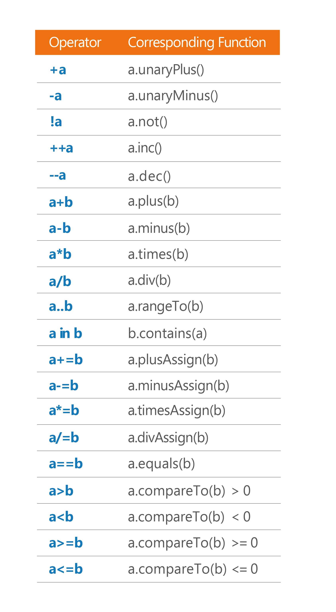

## Item 12: Operator meaning should be consistent with its function name

Operator overloading is a powerful feature, and like most powerful features it is dangerous as well. In programming, with great power comes great responsibility. As a trainer, I’ve often seen how people can get carried away when they first discover operator overloading. For example, one exercise involves making a function for calculating the factorial of a number:

``` kotlin
fun Int.factorial(): Int = (1..this).product()

fun Iterable<Int>.product(): Int = 
    fold(1) { acc, i -> acc * i }
```

As this function is defined as an extension function to `Int`, its usage is convenient:

``` kotlin
print(10 * 6.factorial()) // 7200
```

A mathematician will know that there is a special notation for factorials. It is an exclamation mark after a number:

``` kotlin
10 * 6!
```

There is no support in Kotlin for such an operator, but as one of my workshop participants noticed, we can use operator overloading for `not` instead:

``` kotlin
operator fun Int.not() = factorial()

print(10 * !6) // 7200
```

We can do this, but should we? The simplest answer is NO. You only need to read the function declaration to notice that the name of this function is `not`. As this name suggests, it should **not** be used this way. It represents a logical operation, not a numeric factorial. This usage would be confusing and misleading. In Kotlin, all operators are just syntactic sugar for functions with concrete names, as presented in the table below. Every operator can always be invoked as a function instead of using the operator syntax. How would the following look like?

``` kotlin
print(10 * 6.not()) // 7200
```



The meaning of each operator in Kotlin always stays the same. This is a very important design decision. Some languages, like Scala, give you unlimited operator overloading capabilities. This amount of freedom is known to be highly misused by some developers. Reading code using an unfamiliar library for the first time might be difficult even if it has meaningful names of functions and classes. Now imagine operators being used with another meaning, known only to the developers familiar with *category theory*. It would be way harder to understand. You would need to understand each operator separately, remember what it means in the specific context, and then keep it all in mind to connect the pieces to understand the whole statement. We don’t have such a problem in Kotlin, because each of these operators has a concrete meaning. For instance, when you see the following expression:

``` kotlin
x + y == z
```

You know that this is the same as:

``` kotlin
x.plus(y).equal(z)
```

Or it can be the following code if `plus` declares a nullable return type:

``` kotlin
(x.plus(y))?.equal(z) ?: (z === null)
```

These are functions with a concrete name, and we expect all functions to do what their names indicate. This highly restricts what each operator can be used for. Using `not` to return `factorial` is a clear breach of this convention, and should never happen. 

### Unclear cases

The biggest problem is when it is unclear if some usage fulfills conventions. For instance, what does it mean when we triple a function? For some people, it is clear that it means making another function that repeats this function 3 times:

``` kotlin
operator fun Int.times(operation: () -> Unit): ()->Unit = 
    { repeat(this) { operation() } }

val tripledHello = 3 * { print("Hello") }

tripledHello() // Prints: HelloHelloHello
```

For others, it might be clear that it means that we want to call this function 3 times[1](chap65.xhtml#fn-diff):

``` kotlin
operator fun Int.times(operation: ()->Unit) {
   repeat(this) { operation() }
}

3 * { print("Hello") } // Prints: HelloHelloHello
```

When the meaning is unclear, it is better to favor descriptive extension functions. If we want to keep their usage operator-like, we can make them infix:

``` kotlin
infix fun Int.timesRepeated(operation: ()->Unit) = {
   repeat(this) { operation() }
}

val tripledHello = 3 timesRepeated { print("Hello") }
tripledHello() // Prints: HelloHelloHello
```

Sometimes it is better to use a top-level function instead. Repeating function 3 times is already implemented and distributed in the stdlib:

``` kotlin
repeat(3) { print("Hello") } // Prints: HelloHelloHello
```

### When is it fine to break this rule?

There is one very important case when it is fine to use operator overloading in a strange way: When we design a Domain Specific Language (DSL). Think of a classic HTML DSL example:

``` kotlin
body {
    div {
        +"Some text"
    }
}
```

You can see that to add text into an element we use `String.unaryPlus`. This is acceptable because it is clearly part of the Domain Specific Language (DSL). In this specific context, it’s not a surprise to readers that different rules apply.

### Summary

Use operator overloading conscientiously. The function name should always be coherent with its behavior. Avoid cases where operator meaning is unclear. Clarify it by using a regular function with a descriptive name instead. If you wish to have a more operator-like syntax, then use the `infix` modifier or a top-level function.