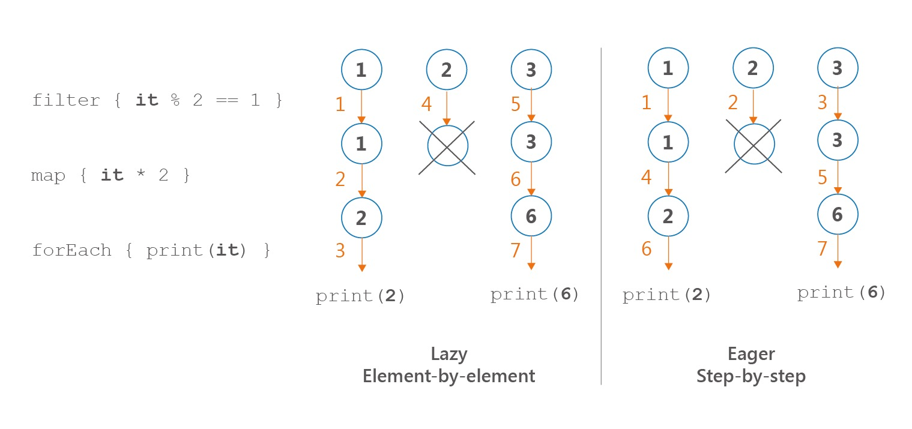
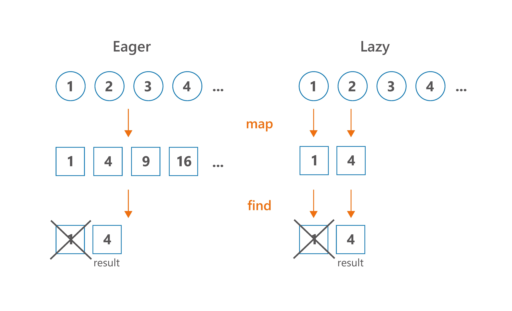

## Item 49: Prefer Sequence for big collections with more than one processing step

People often miss the difference between `Iterable` and `Sequence`. It is understandable since even their definitions are nearly identical:

``` kotlin
interface Iterable<out T> {
   operator fun iterator(): Iterator<T>
}

interface Sequence<out T> {
   operator fun iterator(): Iterator<T>
}
```

You can say that the only formal difference between them is the name. Although `Iterable` and `Sequence` are associated with totally different usages (have different contracts), so nearly all their processing functions work in a different way. `Sequences` are lazy, so intermediate functions for `Sequence` processing don’t do any calculations. Instead, they return a new `Sequence` that decorates the previous one with the new operation. All these computations are evaluated during a terminal operation like `toList` or `count`. Iterable processing, on the other hand, returns a collection like `List` on every step. 

``` kotlin
public inline fun <T> Iterable<T>.filter(
   predicate: (T) -> Boolean
): List<T> {
   return filterTo(ArrayList<T>(), predicate)
}

public fun <T> Sequence<T>.filter(
   predicate: (T) -> Boolean
): Sequence<T> {
   return FilteringSequence(this, true, predicate)
}
```

As a result, collection processing operations are invoked once they are used. `Sequence` processing functions are not invoked until the terminal operation (an operation that returns something else but `Sequence`). For instance, for `Sequence`, `filter` is an intermediate operation, so it doesn’t do any calculations, but instead, it decorates the sequence with the new processing step. Calculations are done in a terminal operation like `toList`.


```
 1 val seq = sequenceOf(1,2,3)
 2 val filtered = seq.filter { print("f$it "); it % 2 == 1 }
 3 println(filtered)  // FilteringSequence@...
 4 
 5 val asList = filtered.toList() 
 6 // f1 f2 f3
 7 println(asList) // [1, 3]
 8 
 9 val list = listOf(1,2,3)
10 val listFiltered = list
11   .filter { print("f$it "); it % 2 == 1 } 
12 // f1 f2 f3
13 println(listFiltered) // [1, 3]
```

There are a few important advantages of the fact that sequences are lazy in Kotlin:

- They keep the natural order of operations
- They do a minimal number of operations
- They can be infinite
- They do not need to create collections at every step

Let’s talk about those advantages one-by-one.

### Order is important

Because of how iterable and sequence processing are implemented, the ordering of their operations is different. In sequence processing, we take the first element and apply all the operations, then we take the next element, and so on. We will call it an element-by-element or lazy order. In iterable processing, we take the first operation and we apply it to the whole collection, then move to the next operation, etc.. We will call it step-by-step or eager order. 

```
 1 sequenceOf(1,2,3)
 2        .filter { print("F$it, "); it % 2 == 1 }
 3        .map { print("M$it, "); it * 2 }
 4        .forEach { print("E$it, ") }
 5 // Prints: F1, M1, E2, F2, F3, M3, E6, 
 6 
 7 listOf(1,2,3)
 8        .filter { print("F$it, "); it % 2 == 1 }
 9        .map { print("M$it, "); it * 2 }
10        .forEach { print("E$it, ") }
11 // Prints: F1, F2, F3, M1, M3, E2, E6, 
```



Notice that, if we were to implement those operations without any collection processing functions, but instead using classic loops and conditions, we would have element-by-element order like in sequence processing:

``` kotlin
for (e in listOf(1,2,3)) {
   print("F$e, ")
   if(e % 2 == 1) {
       print("M$e, ")
       val mapped = e * 2
       print("E$mapped, ")
   }
}
// Prints: F1, M1, E2, F2, F3, M3, E6,
```

Therefore element-by-element order that is used in sequence processing is more natural. It also opens the door for low-level compiler optimizations - sequence processing can be optimized to basic loops and conditions. Maybe in the future, it will be. 

### Sequences do the minimal number of operations

Often we do not need to process the whole collection at every step to produce the result. Let’s say that we` have a collection with millions of elements, and after processing, we only need to take the first 10. Why process all the other elements? Iterable processing doesn’t have the concept of intermediate operations, so the whole collection is processed as if it were to be returned on every operation. Sequences do not need that, and so they will do the minimal number of operations required to get the result. 



Take a look at the example, where we have a few processing steps and we end our processing with `find`:

``` kotlin
(1..10).asSequence()
   .filter { print("F$it, "); it % 2 == 1 }
   .map { print("M$it, "); it * 2 }
   .find { it > 5 }
// Prints: F1, M1, F2, F3, M3,

(1..10)
   .filter { print("F$it, "); it % 2 == 1 }
   .map { print("M$it, "); it * 2 }
   .find { it > 5 }
// Prints: F1, F2, F3, F4, F5, F6, F7, F8, F9, F10, 
// M1, M3, M5, M7, M9,
```

For this reason, when we have some intermediate processing steps and our terminal operation does not necessarily need to iterate over all elements, using a sequence will most likely be better for the performance of your processing. All that while looking nearly the same as the standard collection processing. Examples of such operations are `first`, `find`, `take`, `any`, `all`, `none` or `indexOf`.

### Sequences can be infinite

Thanks to the fact that sequences do processing on-demand, we can have infinite sequences. A typical way to create an infinite sequence is using sequence generators like `generateSequence` or `sequence`. The first one needs the first element and a function specifying how to calculate the next one:

``` kotlin
generateSequence(1) { it + 1 }
       .map { it * 2 }
       .take(10)
       .forEach { print("$it, ") }
// Prints: 2, 4, 6, 8, 10, 12, 14, 16, 18, 20, 
```

The second mentioned sequence generator - `sequence` - uses a suspending function (coroutine[2](chap65.xhtml#fn-coroutine)) that generates the next number on demand. Whenever we ask for the next number, the sequence builder runs until a value is yielded using `yield`. The execution then stops until we ask for another number. Here is an infinite list of the next Fibonacci numbers:

``` kotlin
val fibonacci = sequence {
   yield(1)
   var current = 1
   var prev = 1
   while (true) {
       yield(current)
       val temp = prev
       prev = current
       current += temp
   }
}

print(fibonacci.take(10).toList()) 
// [1, 1, 2, 3, 5, 8, 13, 21, 34, 55]
```

Notice that infinite sequences need to have a limited number of elements at some point. We cannot iterate over infinity. 

``` kotlin
print(fibonacci.toList()) // Runs forever
```

Therefore we either need to limit them using an operation like `take`, or we need to use a terminal operation that will not need all elements, like `first`, `find`, `any`, `all`, `none` or `indexOf`. Basically, those are the same operations for which sequences are more efficient because they do not need to process all elements. Although notice that for most of those operations, it is easy to fall into an infinite loop. `any` can only return `true` or run forever. Similarly `all` and `none` can only return `false` on an infinite collection. As a result, we generally either limit the number of elements by `take`, or we ask for just the first element using `first`.

### Sequences do not create collections at every processing step

Standard collection processing functions return a new collection at every step. Most often it is a `List`. This could be an advantage - after every point, we have something ready to be used or stored. But it comes at a cost. Such collections need to be created and filled with data on every step. 

``` kotlin
numbers
   .filter { it % 10 == 0 } // 1 collection here
   .map { it * 2 } // 1 collection here
   .sum() 
// In total, 2 collections created under the hood

numbers
   .asSequence()
   .filter { it % 10 == 0 }
   .map { it * 2 }
   .sum() 
// No collections created 
```

This is a problem especially when we are dealing with big or heavy collections. Let’s start from an extreme and yet common case: file reading. Files can weigh gigabytes. Allocating all the data in a collection at every processing step would be a huge waste of memory. This is why by default we use sequences to process files. 

As an example, let’s analyze crimes in the Chicago city. This city, like many others, shared on the internet the whole database of crimes that took place there since 2001[3](chap65.xhtml#fn-footnote_81_note). This dataset at the moment weights over 1.53 GB. Let’s say that our task is to find how many crimes had cannabis in their descriptions. This is what a naive solution using collection processing would look like (`readLines` returns `List<String>`):

``` kotlin
// BAD SOLUTION, DO NOT USE COLLECTIONS FOR 
// POSSIBLY BIG FILES
File("ChicagoCrimes.csv").readLines()
   .drop(1) // Drop descriptions of the columns
   .mapNotNull { it.split(",").getOrNull(6) } 
    // Find description
   .filter { "CANNABIS" in it } 
   .count()
   .let(::println)
```

The result on my computer is `OutOfMemoryError`. 

Exception in thread “main” java.lang.OutOfMemoryError: Java heap space

No wonder why. We create a collection and then we have 3 intermediate processing steps, which add up to 4 collections. 3 out of them contain the majority of this data file, which takes 1.53 GB, so they all need to consume more than 4.59 GB. This is a huge waste of memory. The correct implementation should involve using a sequence, and we do that using the function `useLines` that always operates on a single line:

``` kotlin
File("ChicagoCrimes.csv").useLines { lines ->
// The type of `lines` is Sequence<String>
   lines
       .drop(1) // Drop descriptions of the columns
       .mapNotNull { it.split(",").getOrNull(6) } 
       // Find description
       .filter { "CANNABIS" in it } 
       .count()
       .let { println(it) } // 318185
}
```

On my computer it took 8.3s. To compare the efficiency of both ways, I made another experiment and I reduced this dataset size by dropping columns I don’t need. This way I achieved `CrimeData.csv` file with the same crimes but with a size of only 728 MB. Then I did the same processing. In the first implementation, using collection processing, it takes around 13s; while the second one, using sequences, around 4.5s. As you can see, using sequences for bigger files is not only for memory but also for performance. 

Although a collection does not need to be heavy. The fact that in every step we are creating a new collection is also a cost in itself, and this cost manifests itself when we are dealing with collections with a larger number of elements. The difference is not huge - mainly because created collections after many steps are initialized with the expected size and so when we add elements we just place them in the next position. This difference is still substantial, and it is the main reason why we should **prefer to use Sequence for big collections with more than one processing step**. 

By “big collections” I mean both many elements and really heavy collection. It might be a list of integers with tens of thousands of elements. It might also be a list with just a few strings, but so each long that they all take many megabytes of data. Those are not common situations, but they sometimes happen. 

By one processing step, I mean more than a single function for collection processing. So if you compare these two functions:

``` kotlin
fun singleStepListProcessing(): List<Product> {
   return productsList.filter { it.bought }
}

fun singleStepSequenceProcessing(): List<Product> {
   return productsList.asSequence()
           .filter { it.bought }
           .toList()
}
```

You will notice that there is nearly no difference in performance (actually simple list processing is faster because its `filter` function is inline). Although when you compare functions with more than one processing step, like the functions below, which use the `filter` and then `map`, the difference will be visible for bigger collections. To see a difference, let’s compare typical processing with two and three processing steps for 5000 products:

``` kotlin
fun twoStepListProcessing(): List<Double> {
   return productsList
           .filter { it.bought }
           .map { it.price }
}

fun twoStepSequenceProcessing(): List<Double> {
   return productsList.asSequence()
           .filter { it.bought }
           .map { it.price }
           .toList()
}

fun threeStepListProcessing(): Double {
   return productsList
           .filter { it.bought }
           .map { it.price }
           .average()
}

fun threeStepSequenceProcessing(): Double {
   return productsList.asSequence()
           .filter { it.bought }
           .map { it.price }
           .average()
}
```

Below you can see the average results on a MacBook Pro (Retina, 15-inch, Late 2013)[4](chap65.xhtml#fn-footnote_82_note) for 5000 products in the `productsList`:

``` kotlin
twoStepListProcessing                        81 095 ns
twoStepSequenceProcessing                    55 685 ns
twoStepListProcessingAndAcumulate            83 307 ns
twoStepSequenceProcessingAndAcumulate         6 928 ns
```

It is hard to predict what performance improvement we should expect. From my observations, in a typical collection processing with more than one step, for at least a couple of thousands of elements, we can expect around a 20-40% performance improvement. 

### When aren’t sequences faster?

There are some operations where we don’t profit from this sequence usage because we have to operate on the whole collection either way. `sorted` is an example from Kotlin stdlib (currently it is the only example). `sorted` uses optimal implementation: It accumulates the `Sequence` into `List` and then uses `sort` from Java stdlib. The disadvantage is that this accumulation process takes some additional time if we compare it to the same processing on a `Collection`(although if Iterable is not a `Collection` or array, then the difference is not significant because it needs to be accumulated as well).

It is controversial if `Sequence` should have methods like `sorted` because sequences with a method requiring all elements to calculate the next one are only partially lazy (evaluated when we need to get the first element) and don’t work on infinite sequences. It was added because it is a popular function and it is much easier to use it in this way. Although Kotlin developers should remember its flaws, and especially that it cannot be used on infinite sequences.

``` kotlin
generateSequence(0) { it + 1 }.take(10).sorted().toList() 
// [0, 1, 2, 3, 4, 5, 6, 7, 8, 9]
generateSequence(0) { it + 1 }.sorted().take(10).toList() 
// Infinite time. Does not return.
```

`sorted` is a rare example of processing step which is faster on `Collection` than on `Sequence`. Still, when we do a few processing steps and single sorted function (or other function that needs to work on the whole collection), we can expect a performance improvement using sequence processing.

``` kotlin
// Benchmarking measurement result: 150 482 ns 
fun productsSortAndProcessingList(): Double {
    return productsList.sortedBy { it.price }
        .filter { it.bought }
        .map { it.price }
        .average()
}

// Benchmarking measurement result: 96 811 ns 
fun productsSortAndProcessingSequence(): Double {
    return productsList.asSequence()
        .sortedBy { it.price }
        .filter { it.bought }
        .map { it.price }
        .average()

}
```

### What about Java stream?

Java 8 introduced streams to allow collection processing. They act and look similar to Kotlin sequences.

``` kotlin
productsList.asSequence()
       .filter { it.bought }
       .map { it.price }
       .average()

productsList.stream()
       .filter { it.bought }
       .mapToDouble { it.price }
       .average()
       .orElse(0.0)
```

Java 8 streams are lazy and collected in the last (terminal) processing step. Three big differences between Java streams and Kotlin sequences are the following:

- Kotlin sequences have many more processing functions (because they are defined as extension functions) and they are generally easier to use (this is a result of the fact that Kotlin sequences were designed when Java streams was already used — for instance we can collect using `toList()` instead of `collect(Collectors.toList())`)
- Java stream processing can be started in parallel mode using a parallel function. This can give us a huge performance improvement in contexts when we have a machine with multiple cores that are often unused (which is common nowadays). Although use this with caution as this feature has known pitfalls[5](chap65.xhtml#fn-paralell_stream).
- Kotlin sequences can be used in common modules, Kotlin/JVM, Kotlin/JS, and Kotlin/Native modules. Java streams only in Kotlin/JVM, and only when the JVM version is at least 8.

In general, when we don’t use parallel mode, it is hard to give a simple answer which of Java stream or Kotlin sequence is more efficient. My suggestion is to use Java streams rarely, only for computationally heavy processing where you can profit from the parallel mode. Otherwise, use Kotlin stdlib functions to have a homogeneous and clean code that can be used in different platforms or on common modules.

### Kotlin Sequence debugging

Both Kotlin Sequence and Java Stream have the support that helps us debug elements flow at every step. For Java Stream, it requires a plugin named “Java Stream Debugger”. Kotlin Sequences also required plugin named “Kotlin Sequence Debugger”, though now this functionality is integrated into Kotlin plugin. Here is a screen showing sequence processing at every step:


### Summary

Collection and sequence processing are very similar and both support nearly the same processing methods. Yet there are important differences between the two. Sequence processing is harder, as we generally keep elements in collections and so changing to collections requires a transformation to sequence and often also back to the desired collection. Sequences are lazy, which brings some important advantages:

- They keep the natural order of operations
- They do a minimal number of operations
- They can be infinite
- They do not need to create collections at every step

As a result, they are better to process heavy objects or for bigger collections with more than one processing step. Sequences are also supported by Kotlin Sequence Debugger that can help us by visualizing how elements are processed. Sequences are not to replace classic collection processing. You should use them only when there’s a good reason to, and you’ll be rewarded with significant performance optimization.