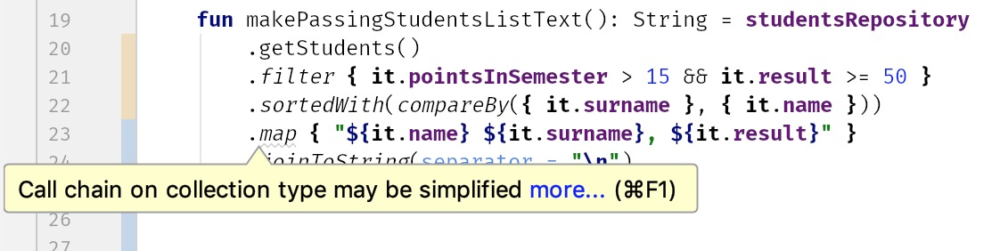

## Item 50: Limit the number of operations

Every collection processing method is a cost. For standard collection processing, it is most often another iteration over elements and additional collection created under the hood. For sequence processing, it is another object wrapping the whole sequence, and another object to keep operation[6](chap65.xhtml#fn-seqinline). Both are costly especially when the number of processed elements is big. Therefore we limit the number of collection processing steps and we mainly do that by using operations that are composites. For instance, instead of filtering for not null and then casting to non-nullable types, we use `filterNotNull`. Or instead of mapping and then filtering out nulls, we can just do `mapNotNull`. 

``` kotlin
class Student(val name: String?)

// Works
fun List<Student>.getNames(): List<String> = this
   .map { it.name }
   .filter { it != null }
   .map { it!! }

// Better
fun List<Student>.getNames(): List<String> = this
   .map { it.name }
   .filterNotNull()

// Best
fun List<Student>.getNames(): List<String> = this
   .mapNotNull { it.name }
```

The biggest problem is not the misunderstanding of the importance of such changes, but rather the lack of knowledge about what collection processing functions we should use. This is another reason why it is good to learn them. Also, help comes from warnings which often suggest us to introduce a better alternative.



Still, it is good to know alternative composite operations. Here is a list of a few common function calls and alternative ways that limit the number of operations:


### Summary

Most collection processing steps require iteration over the whole collection and intermediate collection creation. This cost can be limited by using more suitable collection processing functions.